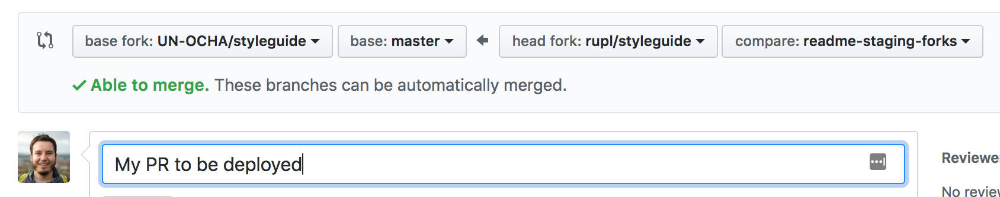
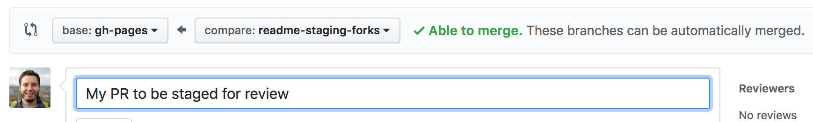

# UNOCHA Frontend styleguide

This site is an evolving list of components and resources for OCHA websites.

The guide is a living document created to meet the needs of OCHA's developers and designers. If you have any feedback, questions or comment please contact digitalservices@humanitarianresponse.info

## Common Design

The [Common Design](https://un-ocha.github.io/styleguide/common-design) is a unified design system for OCHA platforms.

## OCHA Basic Drupal Theme

[OCHA Basic](https://un-ocha.github.io/styleguide/ocha) is a minimal starter theme for Drupal incorporating the Common Design header and footer.

## Individual website component libraries

The individual component libraries are intended to document the front end for the project.

[Humanitarian ID component library & guidelines](https://un-ocha.github.io/styleguide/hid)

## Shared libraries

[Icon library](https://un-ocha.github.io/styleguide/icons)

## Related links

[OCHA Basic Drupal Theme](https://github.com/UN-OCHA/ocha_basic)

[UNOCHA Graphics Style Book (pdf)](https://www.unocha.org/sites/unocha/files/dms/Documents/GraphicsStyleBook_for_public.pdf)

## Running locally

The styleguide uses the following tools:

* [Ruby](https://www.ruby-lang.org/en/)
* [Bundler](http://bundler.io/)
* [Jekyll](https://jekyllrb.com)
* [Node](https://nodejs.org/)
* [Gulp](https://gulpjs.com)

Additionally, using [RVM](https://rvm.io/) and [NVM](https://github.com/creationix/nvm) (Ruby/Node Version Manager) makes it easy to stay on the right version of Ruby and Node without disrupting your other projects.

### Clone the repo

```
git clone git@github.com:UN-OCHA/styleguide.git
```

### Install the required gems

```
rvm use
bundle install
```

If you run into issues installing `nokogiri` try following the package installation/upgrade commands for your system in this [nokogiri GitHub issue](https://github.com/sparklemotion/nokogiri/issues/1099).

### Install the front end dependencies

```
nvm use
npm install
```

### Local development

* `gulp help`: Get a full command listing
* `gulp dev`: Run the site in development mode. It will compile everything (including Jekyll), launch [browser-sync](https://browsersync.io) for multi-device testing, and watch the filesystem for new changes:

Default URL is http://localhost:4000/

### Jekyll

There's a local config file `_config.dev.yml` which upon completing `npm install` should be ignored by version control. You can add any local-specific Jekyll config there for testing, and leave `_config.yml` for production values.

If we ever want to set defaults in the dev config run the following command to allow git to "notice" the changes, commit them, then run `npm postinstall` to reset the working tree so that the file will continue being ignored.

```
# https://stackoverflow.com/a/43535767/175551
git update-index --no-skip-worktree _config.dev.yml
```

### CSS & Sass

Gulp is used to generate CSS from Sass. You can use `gulp dev` as an all-in-one command for regular development, but here are a few single commands you might find useful:

`gulp dev:sass` will generate:

* OCHA Basic extras styles (`gulp dev:sass:ochaextras`)
* Common Design styles (`gulp dev:sass:commondesign`)
* Styleguide styles (`gulp dev:sass:styleguide`)

### Deployment

There are Sass sourcemaps included for developer convenience, but they should be excluded when finalizing changes. There is an npm task that allows a "production" compile to run, which then presents the changes for review:

```
npm run deploy
```

## Staging changes for review

Since this repo is public, each user on GitHub is permitted to fork the repository to their personal account. When you want to stage something for review, there is a different procedure than when submitting changes for inclusion in the official styleguide.

### First-time: setting up your fork

1. Navigate to https://github.com/un-ocha/styleguide and use the "Fork" button in the upper-right. Fork it to your personal account.
2. Once the repo appears, copy the fork's URL using the **Clone or Download** widget.
  * If you already have a local copy of the styleguide you need to add this URL as a `remote` using the following command: `git remote add YOURNAME YOUR-REPO-URL`.
  * If you never cloned the styleguide before now, it will automatically name the remote `origin` and for now you don't have to worry about where your code ends up when pushing.
3. Create a copy of the `master` branch and call it `gh-pages` — then push this to your personal fork in order to allow PRs to be staged: `git co master; git co -b gh-pages; git push -u YOURNAME gh-pages`

:link: [GitHub provides up-to-date docs for deploying GitHub Pages websites](https://help.github.com/articles/configuring-a-publishing-source-for-github-pages/#default-source-settings-for-repositories-without-the-username-naming-scheme).

Using the link as a guide, we recommend you configure your repository to build off of `gh-pages` so that you aren't merging to master when staging changes. Doing so would require force pushing or other git gymnastics later on once the work has been merged to `UN-OCHA/styleguide` and you pull those changes into your master.

### Each time: deploying to your fork and creating PRs

In the personal fork, you may create PRs against one of two base branches:

**Deploying:** Create a PR against `UN-OCHA/styleguide`:`master` that will be sent immediately to production upon merging.



**Staging for review:** Create a PR against `YOU/styleguide`:`gh-pages` to provide others with a staging URL for review or QA. See your repo's **Settings** to find out where the staging URL is located.




## Individual project CSS

### HID assets

The HID section uses styles from the HID staging site.

### OCHA Basic assets

The OCHA Basic section uses styles from the [OCHA Basic](https://github.com/un-ocha/ocha_basic) repository.
